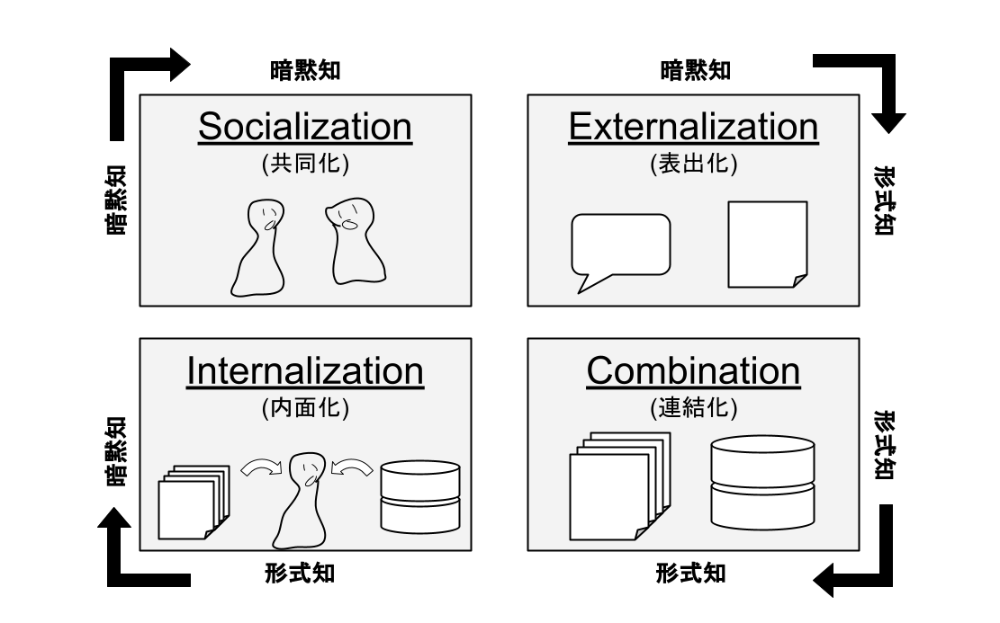
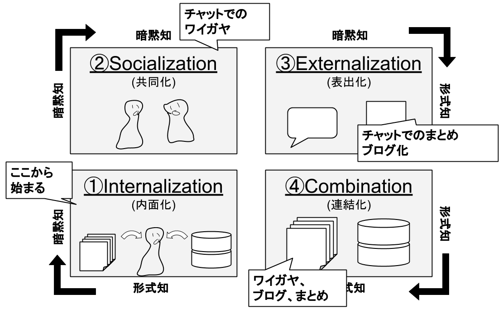
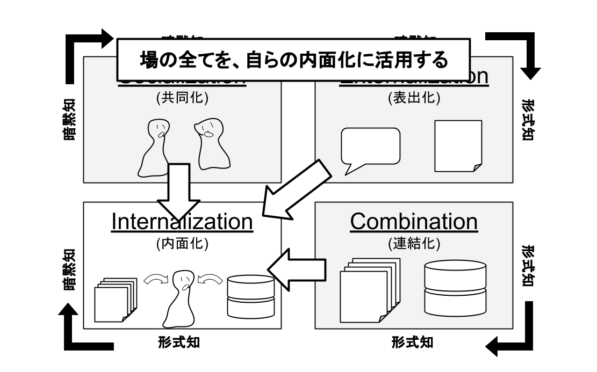
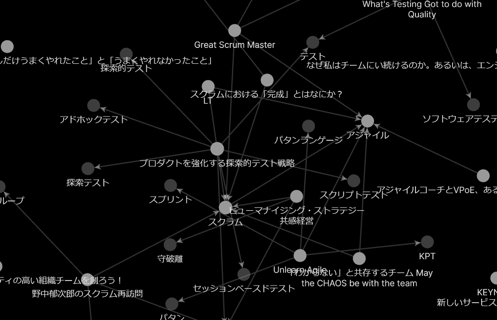

# イベント当日

## カンファレンスでの学びを何倍にも深めちゃおう

<!-- dora_e_m(いきいきいくおが執筆しています) -->

### カンファレンスは知の交差点

カンファレンス。半日から丸一日、規模の大きなものだと数日間に渡って開催されるものが多いですね。そして、だいたい複数トラックが平行して走っています。異なる現場で醸成されたバリエーション豊かな実践知が惜しげもなく披露される…そう考えてみると、なんて贅沢なイベントなんでしょう。

そして、カンファレンスではセッションだけではなく、終了後の質疑応答や参加者同士の議論、そして参加者によるレポートなど、様々な形で知が交差し、融合し、1人では辿り着けなかったような知の地平にまで我々を誘ってくれるのです。

この章では、「知の交差点」であるカンファレンスにおける学びを何倍も効果的なものにするための考え方を紹介します。

### SECIモデルで考える

学びを最大化していく上で、ナレッジマネジメントの枠組みである"SECIモデル"をベースに解説していきます。このSECIモデルというものは、「失敗の本質」などの著作や、スクラムの元となった論文"new new product development game"で知られる野中郁次郎教授により提唱されたモデルです。

個人が持つ暗黙的な知識、暗黙知が以下のような4つの変換プロセスを経て集団や組織の集合知へと発展してゆく、という考え方です。

- 共同化（個の暗黙知→場の暗黙知）
- 表出化（場の暗黙知→形式知）
- 連結化（形式知の融合による新たな形式知の生成）
- 内面化（形式知を咀嚼し自らの暗黙知とする）

### セッションでいかに学ぶか

いうなれば、個々のセッションはスピーカーそれぞれの現場で共同化された暗黙知が表出化したものになります。そして、セッションに参加する立場の人間は、まずその形式知を自分なりに理解し解釈すること、換言すると「内面化する」ことから始めます。セッション聴講時のSECIモデルの起点は次の図で示すように「内面化」になります。

#### 知らないキーワードが飛び交う場では内面化に集中する

初学者の状態で勉強会やカンファレンスに参加すると、これまで見たこともない情報の洪水に圧倒され、堂々たる講演者のふるまいに憧れを抱くのと同時に、「何言っているのか全然わからない」という状態になります。ですが、「自分は何も知らない…」と気落ちする必要はありません。おそらく、その場に参加するまでは「知らない」ということも知らなかったはずです。その場に参加することで「知らないということを知っている（無知の知）」状態に到達しており、参加前の自分自身よりは確実に前進しているのです。

さて、それではこの「知らないということを知っている」状態で参加した場合には、どのように行動することが学びの最大化につながるのでしょうか。私は「内面化に全集中」することをお勧めします。

チャットのワイガヤ、誰かがまとめてくれたセッションの概要、まとめ記事。これら全てがインプット源になります。そしてもうひとつ大切なのが、自分自身でメモを取ること。耳慣れないキーワードについてもとりあえずメモに記載しておき、のちほど調査しましょう。（運がよければ、チャットで誰かが解説してくれていることもあります。）

メモの取り方についてはそれぞれ流儀があると思いますので、ご自身のやりやすい方法を採用するのがよいです。私からお勧めを挙げるとするならばObsidian[^obsidian]で自分のナレッジを管理する方法です。詳しくはこちらの記事[^obsidianblog]をご覧いただくとわかりやすいです。私のお気に入りはグラフビュー機能で、カンファレンス中で頻出したキーワード、自分が関心を持っている分野が可視化され、学びの方向性を明らかにするための心強いサポートになってくれます。(なお、この図ではまだ類似キーワードをまとめるといった整理ができていないため、少し雑多なものになっていますがご了承ください)

[^obsidian]: OBSIDIAN https://obsidian.md/

[^obsidianblog]: ナレッジ管理をObsidianに移行してみた https://blog.mamansoft.net/2021/01/16/use-obsidian-so-that-manage-knowledge/

カンファレンスには、様々な楽しみ方があります。目的も人それぞれでしょう。ですから、初学者であっても自身の学習よりも場の雰囲気を楽しむことを重視する、という姿勢も多いに歓迎されるでしょう。参加者同士のつながり、という得難い財産ともめぐり合うことでしょう。

しかし、私のお勧めとしては「内面化に全集中」です。学びを深めることが自分自身のためになるのももちろんですが、深く学んでいるほうがより深く楽しめるのです。なので「この分野は素人だな」と感じ、また実際知らない単語が飛び交っているような現場については内面化に集中し、次回以降「ワイガヤ」の渦に飛び込んでゆくのがよいと、私は考えています。

#### ワイガヤで共同化の渦に飛び込め

ある程度その分野について学んだ、コミュニティに馴染んでいる…。そういった段階であれば「ワイガヤ」、共同化の渦に飛び込むことをおすすめします。近年(2021年1月現在)のオンラインカンファレンスでは、Zoom + Discordという形態がメジャーになっています。講演はZoomで聞きながら、Discordでその内容にリアクションしたり、自分の個人的な気づきをつぶやいたり、はたまた単に盛り上げたりと、多様な楽しみ方ができるようになっています。

疑問に思ったことを投げかけると誰かが即反応してくれたり、講演への解釈に周囲から賛同が得られたり。オンラインでの講演に熟達した講演者であれば、リアルタイムにコメントを拾ってくれることもあります。もはや講演というよりはヘビーメタルのライブに参加しているような一体感が、そこに立ち現れていきます。また、あなたが投げた疑問やその疑問への回答は、他の誰かが理解を深めるための役に立つことが少なからずあるので、積極的に発信していきましょう。

### 後日、学びを深める

ブログの書き方、まとめ方については他の執筆者がグレートな記事を書いてくれるはずなので、ここでは詳細には触れません。

#### 表出化

カンファレンスで学んだ内容を咀嚼できたら、ぜひブログなど何らかの形で発信していきましょう。前述のObsidianなどをうまく活用しておくと、構造化されたナレッジとして記事化しやすいです。

#### 連結化

他の参加者のブログは、自分と異なる目線で書かれているため、多様な視点を獲得するのに役立てることができます。また、他者のブログで得られた着想を自身のアウトプットへ還元してゆくことで連結化が進み、「カンファレンス参加者」という場単位で考えたときに学びのスパイラルが一歩前進したものになります。「人の意見にのっかって記事を書くなんて、なんか悪いな…」なんて思わず、どんどんのっかっていきましょう！

もちろん、あたかも自分自身が思いついたかのように書き、引用元を明確にしない、といったことはやめましょう。それは場としてのナレッジ蓄積に寄与しないばかりか、せっかくナレッジを共有してくれる人の「共有しよう」という気持ちを損ねる行動になってしまいます。

### キミだけのナレッジマネジメント方法を見つけて爆速で成長しちゃおう！

カンファレンスでの学びを効果的にするための、私なりのノウハウを紹介しました。お読みになった方はお気づきかと思いますが、主に初学者がどう学ぶかという点に重点をおいて書きました。初学者の学ぶスピードが向上すると、もっとカンファレンスを楽しめるだろうなという想い。そして熟達した人たちならほっといても自分たちで学び方を編み出せるでしょう、という打算的な想いから、こういった構成にしました。

ここに書いてある方法は、決して唯一無二の方法ではありません。また、ここを起点に学び始めたとして、学びを深める中できっと自分自身の学び方を見つけていくでしょう。それは私が実践している方法とは異なるでしょうし、そうであるべきだ、とも思います。自分自身と向き合い、カンファレンスという素敵な場での学びを最大化するべく、どんどん実験をしていっていただければ幸いです。

## アウトプットしながらセッションを聴いたり雑談してみよう

<!-- aki.mが執筆しています -->

本章では、aki.mが実践しているアウトプットしながらセッションを聴く方法について書いています。(参考記事:https://aki-m.hatenadiary.com/entry/2021/01/20/234544)

### アウトプットしながらセッションを聴き始めたきっかけ

自分が尊敬しているオキザリスチームの皆さんやびばさんが毎回セッション後即座にアウトプットをしていて、この真似をしてみようと思ったのが、アウトプットしながらセッションを聴き始めたきっかけです。

### アウトプットしながらセッションを聴くと起こるいいこと

#### カンファレンスに貢献することができる

自分が、アウトプットすることで感じる一番大きないいことがこれです。
カンファレンスに参加すると、言葉に出来ないほどの勇気と多数の学びを得ることができます。そして、勇気と学びの源にはカンファレンスの参加者の方々がいます。

アウトプットしながらセッションを聴き、セッション終了後にアウトプットを公開することで、カンファレンスの参加者の方々に恩返しをすることができます。

アウトプットを公開することで恩返しできると自分が考えている理由は、以下の4点です。

- 何らかをアウトプットすることで、カンファレンスの記録を残すことができる。
- カンファレンス参加者がカンファレンスを後からふりかえる助けになる
- カンファレンスの感想や感謝の気持ちをカンファレンス参加者に伝える(書く)ことができる
- カンファレンスに参加しなかった人にもカンファレンスの存在を認知してもらえる。(次回にカンファレンスがあった時に参加したいと思ってもらえる)

#### 学びを深められる

漠然とセッションを聴く形でも十分学びを深めることはできますが、アウトプットをしながらセッションを聴くことで、より学びを深めることができます。

アウトプットしてみることで、セッションの内容を何となくでしか理解できていないことに気が付けたり、自分が引っかかっている部分、興味がある部分に気が付くことができます。また、アウトプットしたものを後日ふりかえりすることで、学びをさらに深めることができます。

#### カンファレンス後にカンファレンス参加者と話をしやすくなる

アウトプットしたものがカンファレンス参加者に届くと、カンファレンス後に向こうから話しかけてもらえたり、反応をいただけることがあります。
また、アウトプットがきっかけになって会話に自然と混ざることができたり、アウトプットしたものを会話の種にできたりします。

### アウトプットするタイミング

アウトプットするタイミングはいつでも良いのですが、なるべく早く(当日中に)アウトプットするメリットとゆっくり(後日に)アウトプットするメリットをそれぞれ紹介していきます。

#### なるべく早く(当日中に)アウトプットする

早いタイミング(当日中)でアウトプットすると、カンファレンスの記憶が新鮮な状態でアウトプットすることになるので、カンファレンスの内容を思い出すためにかかる時間が少なくて済みます。

また、早いタイミングでアウトプットすることを事前に決めておくと、事前準備のモチベーション向上に繋がります。

なお、個人的には、自分が感じたことに加工をしなくて済むというメリットも感じています。時間をかけてアウトプットすると、どうしても他の人に良く見せようと感情に加工をしたり、参加者の感想ブログなどに影響されて自分の本心とはずれた感想を書いてしまうリスクがありますが、早くアウトプットすることで、このリスクを低減できます。

※自身がやっている方法については、この後の「なるべく早く(当日中に)アウトプットする方法」の節で紹介します。

#### ゆっくり(後日に)アウトプットする

ゆっくり(後日に)アウトプットすると、時間的制約がない分、自分が好きなタイミングで好きなだけの時間をかけてアウトプットをすることができます。
また、セッションを聴き直したり他の参加者の感想ブログを参照することで、当日気が付かなかったことに気づけたり、他参加者の感想ブログを引用＋自分の意見を追記、といったようにアウトプットの幅が広がります。

### なるべく早く(当日中に)アウトプットする方法

自分がなるべく早くアウトプットするためにやっていることを書きます。

#### 事前準備

はじめに、カンファレンスになぜ参加するのかを言語化します。たとえば、どういうきっかけで参加したのか、どういう問題意識を自分が持っているのか...などを考えます。
参加したきっかけを言語化することで、自分の問題意識や自分がカンファレンスで心が動きやすいポイントを認知しておくことができます。
これは、カンファレンスの主催者や参加者が知りたい情報になることも多いので、アウトプットする媒体に事前に整理しておいて、そのまま公開することもできます。

次に、カンファレンスを聴くにあたって必要そうな前提知識の収集をします。カンファレンスに参加するにあたって、ある程度の事前知識がないと、まともに感想を書くことができないので、必要最低限の知識をインプットしておきます。必要最低限の知識のインプットは、以下の条件を全て満たしたときに完了したと自分は判断しています。インプットすべき知識は膨大な量があることも多いので、自分なりに定義を決めておくといいかもしれません。

1. カンファレンスの概要が理解できること

カンファレンスの登壇者が過去に登壇している場合、3登壇以上の資料を見て、スタイルが掴めていること。これは登壇者のプレゼンスタイルや考え方に慣れておく目的で行います。動画がある場合は動画も見ます。

2. アウトプットの構成を決めておく

カンファレンスのタイムテーブルが決まっている場合は、タイムテーブルを参考にアウトプットの構成(目次)を作っておきます。特にタイムテーブルがない場合は、アウトプットのひな型を作ります。
ひな型は、びばさんが紹介しているふりかえりカタログ(https://hurikaeri.booth.pm/items/2656128)やふりかえりチートシート(https://hurikaeri.booth.pm/items/1711909)を参考にして作ると良いでしょう。様々なふりかえり手法やふりかえりの型が載っているので、これらを参考にして作ることで、ふりかえりという形でカンファレンスの内容をアウトプットすることができます。
また、ひな型や目次を作ると同時に、どんな内容になりそうかやカンファレンスでどんなことを持ち帰りたいかを頭の中でシミュレーションしておくと、よりスムーズにアウトプットすることが可能です。

<!-- ふりかえりカタログ・チートシートに参照入れるか、ひながたのイメージを入れる -->

#### カンファレンス参加中

カンファレンス参加中は、インプットをしながらアウトプットをしていきます。具体的には、以下の3点を実施しておきます。

1. メモをアウトプットする媒体(ブログ)に書いていく

事前にシミュレーションしていた内容と近ければ、ある程度既に書く内容は整理できているので、事前に決めていた型にすらすら埋めていくことができます。

シミュレーションしていた内容とずれていた場合は、「～だと思っていたのですが、～で驚きました」という形で書いたり、シミュレーションしていた内容とGapがあった部分を、印象に残った部分として書いていきます。

2. 分からないことはエディタにメモを残しておく

分からないことが出てきた場合、まずは文字起こしするつもりでひたすら手を動かして書いてみます。それでも分からない場合、エディタに移しておき、カンファレンス終了後に調べます。5分調べたり整理して理解できない場合、その内容をアウトプットするのは諦めます。

3. 感情の動きがあったらメモを残しておく

感想に繋がりやすいので、メモとして残しておきます。人に見せるような形でメモを書くと時間がかかるので、「え、その考え方めちゃくちゃ素敵」「その発想でてくるの頭よすぎるなー」「すごいなー」など、素直な感情をそのままメモしておきます。

#### カンファレンス参加後

感情の動きをベースに、感想の部分を埋めていきます。
何言っているか分からない部分や、口語になっている部分は改めますが、なるべく加工せずに書いていきます。
その後、簡単に見直ししてアウトプット(公開)します。

### さいごに

カンファレンスに参加しながらアウトプットすると、自分のためにも他の人のためにもなるので、皆さん是非アウトプットしてみてください！
アウトプットしたいけど、どうアウトプットすればいいか分からない、本章に記載したことをやってみたけど難しい、という場合はお気兼ねなく本書の著作者に相談ください。勿論自分(aki.m)も相談に乗ります！
