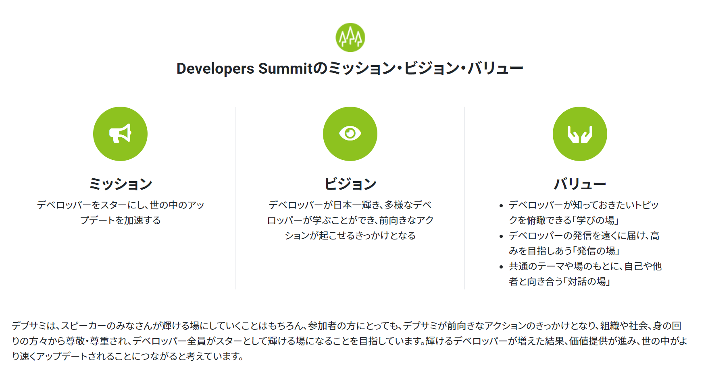
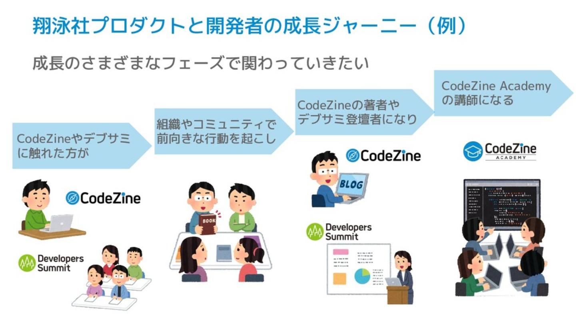

# カンファレンス主催者/運営インタビュー

本章では、いくつかのカンファレンスの主催/運営の立場にいる方にインタビュー形式で、カンファレンスの紹介、テーマ選定やカンファレンスの設計、あるいは参加者に向けてのメッセージなどをお伺いしました。

主催者がどういう意図でテーマを設定しているのか、参加者の皆さんにどうなってほしいのか、などをぜひ感じてください。

## 「デベロッパーをスターに」Developers Summit（デブサミ）が目指していること 近藤佑子@kondoyukoさん

#### ―自己紹介をお願いします
近藤佑子@kondoyukoです。翔泳社にて、CodeZine[^codezine]というWebメディアの編集長と、Developers Summit(デブサミ)[^devsumi]というソフトウエア開発者向けのカンファレンスのオーガナイザーとして関わっています。デブサミのコンテンツ面の取りまとめ役として、イベントのテーマを決めたり、セッションの企画を考えたりしています。例えば、今年のデブサミのテーマは、We are New Normalでした。テーマについては、社外のエンジニアからなるコンテンツ委員の皆さんと、今年一年をふりかえって、去年との違いや、あるいは何を伝えたいかといったあたりを考えてキャッチフレーズを挙げていき、そこからテーマに落とし込んでいます。また、コンテンツ委員さんとセッション選定もやっています。

[^codezine]: CodeZine　https://codezine.jp/

[^devsumi]: Developers Summit https://event.shoeisha.jp/devsumi

#### ―イベントの概要を教えてください
デブサミは2003年から毎年開催しているソフトウエア開発者向けのカンファレンスです。毎年2月に東京・目黒のホテル雅叙園東京にて2日間にわたり開催してきましたが、2021年はオンライン開催となりました。セッション数は招待、公募、スポンサーセッションを合わせて70を超える規模です。参加者は数千人規模です。

また、2011年より順次、地方開催としてデブサミ関西・福岡を、2012年からデブサミ夏、2018年からスピンオフとして若手エンジニア向けのDevelopers Boostというイベントも開催しています。

毎回「自分はもう出し切った、これ以上いいものは作れないな」と思いながら作っていますが、年々、去年よりいいものになったな、と思えるイベントになっています。デベロッパーに聞いてほしい、様々な切り口のセッションを集めたイベントになっていると思いますので、一人でも多くの方に聞いてほしいですし、体験したことない方には体験してほしいです。

#### ―聴講者にどうなってほしいか、などを教えてください
デブサミ2021で初めて、デブサミのMission Vision Valueを言語化しました。これまでうまくまとまらなかったのですが、今回オンライン開催するにあたって、「これまでと同様には盛り上がらないのではないか」「協力してもらえないんじゃないか」という不安から、デブサミの社会的意義をとらえなおすことにしました。デブサミは、コミュニティベースのカンファレンスではなく、出版社/Webメディアをやっている企業主催のカンファレンスです。私自身も開発者ではない立場として「どんな意義があるのかな」と考えたとき、出版社が著者の知見の詰まっている書籍を全国の書店、読者の皆さんに届けるがごとく、デブサミも同じように「スピーカーの知見を広く遠くに届ける」役割を果たせるのではないかと考えました。様々な年齢層・会社にいる方、様々な地域にお住まいの方に、経験や情報を届ける役割・場所としたいと考えました。

ミッションとして、「デベロッパーをスターにし、世の中のアップデートを加速する」[^star]を設定しました。これは、スピーカーがスターになるのはもちろんですが、セッションに参加した人が様々なデベロッパーの発信から影響を受けて前向きなアクションを取り、身の回りの人たち、会社のチーム、社会、家族、友達などから尊敬・尊重され、デベロッパーがスターとして輝ける、そしてそうした人が増えることで世の中のアップデートを加速するということです。

 

[^star]: コロナ禍で開発者向けイベント／講座はいかにオンライン化したか？ Open Developers Conference 2020 Online #opendevcon (2020.12.19) https://speakerdeck.com/kondoyuko/planning-online-events-in-the-time-of-covid-19?slide=21

デブサミに参加してからエンジニア人生が変わったという声をたくさん聞くようになりました。CodeZineやデブサミに触れた方が組織やコミュニティで前向きな行動を起こし、CodeZineの著者やデブサミの登壇者などになってくれることを願っています。

今までは、いいデブサミを作ることが目標だったんですが、最近は、いいデブサミを作ることでデベロッパーがスターになり、世の中がよくなることを目指して(なかなか遠い道ですが)イベントを作っています。

#### ―テーマの選定・設計について。特定技術によらないということで、自由度高すぎて苦労したりしませんか？
デブサミのテーマ選定についてはカンファレンスでも発表した[^devrel]ことがあるのですが、デブサミはセッション数も多いので、公募に応募してもらうにしても登壇を依頼するにしても、テーマが決まらないとイメージが湧かないので、テーマ設定は最優先です。1年間の状況をイメージして、デベロッパーとしてどんなことができるか、どんなメッセージを届けたいのか、をコンテンツ委員と一緒に考えています。デブサミ関西では関西エンジニアに伝えたいことを特に意識する、2月のデブサミではメッセージ性を強くする、デブサミ夏ではDXのようにその年ならではのキーワードを据えて掘り下げるといった形で、イベントごとに少しづつ変えています。また、一言で覚えられる、説明しやすいテーマであることを重視する、「今」を表すことには留意しています。他には、サイトで使用するキービジュアルもあわせて検討したり、サイトのデザインも、親しみが持てるようにカッコイイよりかわいいを意識したりしています。

[^devrel]: 編集者視点でのテックカンファレンスの作り方 DEVREL/JAPAN CONFERENCE 2019 (2019.09.07) https://devrel.tokyo/japan-2019/speakers/kondoyuko/

#### ―イベント設計として気を遣っているところ、楽しむために気を使っているところはありますか？
特定技術・特定テーマによらないカンファレンスなので、幅広い方が聴講対象者となるようなセッションを意識しています。よく「デブサミってとがったセッションないよね」といわれることもあるのですが、幅広くても聴き応えがあるような、例えば深い前提知識を必要としない事例セッションなどを設けるなどの工夫をしています。

またコロナ禍ということもあり、オンライン開催、オンラインならではの可能性を模索し続けた2020年度でした。リアルタイムのやり取りをいかに盛り上げるかという観点で試行錯誤を行い、デブサミ夏でのチャットを活用したディスカッション、デブサミ2021でのオンライン空間EventInを利用したAsk the Speaker/ブース/懇親会の実施など、新しいチャレンジを行っています。

さらに、これまで各地のエンジニアが学べるようにデブサミの地方開催や、また若手のためのイベントDevelopers Boostを行ってきましたが、振り返ってみるとこれらのチャレンジは、Mission Vision Valueのところで話したような、多様な方にデベロッパーの知見を届ける取り組みだったのではと思います。今後も多様なデベロッパーが学べるように、新たなイベントを企画中です。

#### ―イベント参加者が盛り上げてくれるためにこうしてほしい
もちろんTweetもしてほしいですし、チャットも書いてもらいたいですが、デブサミ2021で設けたEventInのような、セッション以外の企画・スペースにぜひ入ってほしいです。ハードル高いと思われるかもしれませんが、コロナ禍で得づらい、新たな人や技術と出会う機会になると思います。「アウェーでどうしよう」と思ったときにどうするかはなかなか難しいところはありますが、登壇者やブース、交流会などに、聞き専でも構わないので近くに行ってみるのがおすすめです。イベントで発信している方、ブースでたくさんの方と出会いたいと思っている方は、話しかけてもらえることを心待ちにしています。

また、オンラインイベントだと仕事をしながら参加される方も多いと思いますが、仕事の手を止めてセッションに集中することでより学びが深くなることと思います。なかなか休みを取って参加してほしいとは言いづらいですが、オフラインカンファレンスだと業務扱いで参加できたように、カンファレンスでの学びが最大化できるような企業の取り組みが増えるといいなと思います。

#### ―なぜ運営として参加しているんですか？
デブサミのオーガナイザーのポストが空いたとき、カンファレンスが好きなことと、カンファレンスでボランティアスタッフ経験があること、色々なコミュニティに参加したり登壇したりしていたことから、自分に向いてるんじゃないか、ぜひやらせてください、と手を上げました。そもそも編集者という立場でなぜカンファレンスやイベントに関わるのかというところが、この問いの答えになるかもしれません。

翔泳社に入社してすぐ、2014年頃に女性エンジニアイベントTechGIRLに参加して、今でもずっと仲良くしていただいている方々にたくさん出会うことができました。そこから、カンファレンスや勉強会によく行くようになりました。そこでエンジニアさんとのつながりを増やし、そこから執筆や登壇の依頼をするなど、仕事に活きることが多かったですね。また、コミュニティでエンジニアが楽しそうに登壇、執筆している姿を見て、自分もやりたくなるという経緯で、今度は参加するだけではなくアウトプットする側として、エンジニアコミュニティとの関わりが増えていきました。

技術書典6で、初めて個人サークルとして参加し、その後の再販Nightで「踊る編集者」というタイトルの登壇[^saihannight]をしました。このタイトルは「踊る阿呆に見る阿呆、同じ阿呆なら踊らにゃ損々」という阿波おどりの一節から取ったのですが、エンジニアが楽しそうにしていることを見ているだけじゃなく一緒に踊る、そうして自分の本分である編集者としての気付きを得ていく。そういう観察者と実践者を行き来するようなあり方を表現して、今も気に入って使っています。

[^saihannight]: 技術同人誌再販Night★#4 #技術書典 の技術書が集合＆LT 2019年5月13日　https://techbook-and-ethanol.connpass.com/event/127154/

現在はカンファレンスで学んだところを仕事で還元したいということで、仕事以上のモチベーションで取り組んでいるつもりです。ただし、コミュニティによるカンファレンスで、ボランタリーベースで関わられているエンジニアの方には頭が上がらず、私はそれ以上の価値が出せているか、常に自問自答しています。

#### ―おススメのカンファレンスがあれば教えてください

2020年に参加したものだと、Scrum Fest Osakaが特に印象に残っています。関わっているコミュニティでセッションを持っていたので企画側で参加したのですが、スクラムやアジャイルにゆかりのある19コミュニティがオンラインで一堂に会するイベントです。雰囲気がすごくあったかくて、トラブルがあっても参加者同士でサポートしあうような感じが心地よく、楽しかったです。

https://www.scrumosaka.org/

## イベントを盛り上げてIT業界を良くしていきたい　藤崎正範 @fujisaki_hb さん

#### ―自己紹介お願いします
ハートビーツの藤崎と申します。私の場合は、JulyTechFestaとInternetWeekに関わらせて頂いています。

July Tech Festa は、「インフラエンジニアの祭典」という位置づけで、みんなで集まる楽しいお祭りをやりたいという思いからスタートしました。当時、InfotalkというIT勉強会をやっていたAIITの小山教授の呼びかけで開催する運びとなりました。昨年からはオンラインに切り替え、継続して開催していこうとしています。July Tech Festaは、完全にボランティアの集まりなので運営メンバーが力尽きるとそこまで、という状況の中、何度かの開催危機を乗り越えながら継続しています。

InternetWeek は、JPNICさん主催で長年開催されている由緒正しきカンファレンスです。インターネットを支える基礎的な内容から、最新のセキュリティ事情まで幅広くプログラムが組まれているのが特徴で、なんと名前のとおり1週間ほど開催されます。以前、登壇させていただいたことをきっかけに私の参加している業界団体で後援したり、プログラム委員として協力させていただいています。5年ほどプログラム委員として活動していて、エンジニアリング組織、運用組織まわりのプログラムを積極的に担当しています。

#### ―イベントの概要を教えて下さい
July Tech Festa
https://www.techfesta.jp

「July Tech Festa」の名前の由来は、7月30日が「システム管理者の日」ということで、そこから July を頂いて July Tech Festa と名付けられました。会場や運営の都合の関係で必ず7月に開催できてきたわけではありませんが、単に開催月をイベント名にしたわけではないので、いつやっても July Tech Festa の名称で開催されています。JTFは有志のボランティアによる運営で、初回は2013年7月。次回の2021年7月18日(日)に、第10回目の開催を予定しています。毎回40人前後の登壇者が居て「はじめての登壇がJuly Tech Festa だった」という方も多いのも特徴です。CFPに応募し採択されたら誰でも登壇でき、初心者でもチャレンジしやすい雰囲気のイベントです。次回は「#今さら聞けないIT技術」と題して開催されます。

Internet Week
https://internetweek.jp

一般社団法人日本ネットワークインフォメーションセンター（JPNIC）主催の有料のカンファレンスです。インターネットに関する技術の研究・開発、 構築・運用・サービスに関わる人々が一堂に会し、 主にインターネットの基盤技術の基礎知識や最新動向を学び、 議論し、理解と交流を深めるためのイベントです。 また、「Internet Week」で得られたものを、 ご自分のフィールドで役立てていただくことにより、 インターネットの普及・促進・発展に貢献する(繋げる)ことを目的としています。

こちらも新型コロナ対応でオンラインに切り替え開催されています。前身となる「IP Meeting」が 1990年にスタート。その後、1997年より Internet Weekという名称に変更し開催されています。2021年も7月にInternet Week ショーケース、11月にInternet Week 2021として準備を進行中です。
https://internet.watch.impress.co.jp/docs/special/1028211.html

#### ―なぜ運営として参加しているのでしょうか？

私の場合は、たまたま両方とも声をかけていただいた、という流れです。インフラエンジニア勉強会hbstudyを頑張って運営していたこともあって、スタッフやりそう、好きそう、という雰囲気が出ていたのかもしれません（笑）。運営として参加するのは結構大変なので、他のスタッフの方々に助けていただいてばかりのときもありますが、それでも続けられているのは「IT業界を少しでも楽しい業界にしたい」という思いがあります。

どうしてそういう思いがあるのかというと、私はIT業界には一人でも多くの優秀な人材が必要だと考えています。そのためには、IT業界がやり甲斐があり楽しそうでないと、優秀な方は他の業界にいってしまいますからね。そういう思いがあるので、カンファレンスの参加者や登壇者、運営の人たちには、ぜひ楽しんで頂きたい、私も楽しみを見つけながらやっていきたい、と考えています。色んなカンファレンスがあってもよいのですが、私の好みは、参加者・登壇者・運営が楽しんでいこうとしているイベントで、そんなイベントに近づいていけるよう意識しながら運営に参加しています。

インフラエンジニア勉強会 hbstudy
https://twitter.com/hbstudy

#### ―テーマはどうやって決めていますか？

基本的に、カンファレンスの運営メンバーでディスカッションしながら決めていきます。私がテーマ決めの際に意識していることは、今のIT業界でどんな内容が求められているのか、という点です。

たとえば、JTF2020では、新型コロナウイルスの関係で初のオンライン開催に切り替えざるをえませんでした。劇的な変化が起こっている状況で、どういうテーマで開催するのがいいのか議論を進めていきました。世の中が、いわば、強制的にリモートワークが必須の世界になったわけですが、その中でIT業界の皆さん、試行錯誤しながら適応していると考えたんです。なんのために試行錯誤しているのか、と考えたときに、僕らが努力していることって、未来のために僕らのエンジニアリングライフを拡張してるんだな、と思いました。それをより推進していくテーマがいいのではないかという話になり、この方向性でディスカッションの場がまとまってから、これをどう表現しようか、という議論に移り、試行錯誤を経て「Extend Your Engineering Culture!」という表現にしよう、いつもの技術ネタに加えて、このコロナ禍でみんなの試行錯誤を共有できる場にしていこう！という様にテーマが決まっていきました。

テーマをどうするか考える際は、その年の運営メンバーで様々な視点からディスカッションされますので、毎回、考え方が若干違います。ただ、そこには「運営メンバーの思いがある」ということを意識していただけるとカンファレンスを別の角度から楽しんでいただけるかもしれません。

余談ですが、このテーマ次第で、CFPへの応募数や応募内容が変わります。特にCFPへの応募数には影響が顕著で、正直、今回はうまく気持ちが伝わらなかったなー、という年もあります。そういう場合は、運営メンバーは必死こいてプログラムを集めることになりますが、これはまた別のお話ということで。笑

話を戻しますと、このように運営に参加しているとやり甲斐として、「思い」をイベントに反映できるということがあげられます。また、その「思い」を持った人たちの集まりの中で共に活動することで、エンジニアとして、社会人として、人として、学ぶことも多々あります。

#### ―一般の参加者に向けてコメントお願いします

オフラインのカンファレンスの場合は、足を運ぶのは大変だけど、「現地参加」ならではの楽しみ方があると思います。単に登壇者の話を聞いて、その内容を持ち帰るだけではなく、カンファレンスの他の参加者はどんな人達なのか、スポンサーブースでスポンサーは何をPRしているのか、配布されているノベルティで欲しいものはないか、懇親会でできる横のつながり、などなど、色んな楽しめるポイントがあります。

また、自分にとって全てのセッションが有益だとは限りません。でもそれでいいんです。私が若い頃、とある業界の先輩が飲みながらこう言ってました。「カンファレンスにいって、聞きたいところだけ聞いて、あとは仕事をする。全部が自分に有益とは限らないわけだから。むしろカンファレンスで仕事をするのが捗る。」と。この方の性格もあるとは思いますが（笑）、一理あると思っています。どのプログラムも聞いてみたら想定した内容と違うかもしれないし、持ち帰れるものがあったらラッキーなんですが、仕事中に開催されるカンファレンスだと、持ち帰るものがないと仕事としては行きづらい、と真面目な方ほど思いがちですよね。その気持ちはとても共感します。でも、冷静に考えて、運が悪いこともあるわけなので、まずはカンファレンス会場に足を運んでみないことには、その結果はわかりません。「迷ったら参加してみる、かならず拾い物があるとは限らない」くらいの気持ちで参加するとよいですし、IT業界ではそれがしやすい職場環境が多いと良いなぁと思っています。

ここ一年でいうと、急にカンファレンスのオンライン化が進みました。今の時点では、まだまだオンラインイベントが大半を占めている状況ですが、オンラインのカンファレンスの場合は、会場に行く必要がなくなった分、作業をしながらラジオ感覚で動画を流せるようになったことが挙げられます。そして距離の問題も無くなりました。地方からでもカンファレンスに気軽に参加できる。そしてカンファレンス費用も場所代が減った分、無料だったり安くなったりしているという印象です。

オンラインのカンファレンスは、物理制約がなくなった分、自由度があがっていますが、登壇者は相手の顔が見えない中で登壇しないといけなかったり、イベントの盛り上がりを場の空気を直接感じることができなくなりました。なんとか参加者の声を掴もうと、運営もtwitterやslido、Miro、Googleフォームなどを試行錯誤しながら使っている状態です。その場その場で最善と思える方法を選び活動していく中で、参加者にお願いしたいのは、ぜひ「運営から指定された各種ツールを使い、登壇者や運営に、反応をしていただけるとありがたい」です。登壇者も運営も、参加者の皆さんに少しでも良い体験をしていただきたいと思いながら、登壇資料をつくったり、開催準備をしています。楽しかった、参加してよかった、勉強になった、のようなポジティブなフィードバックをいただけると、大変だったけどやってよかったー！という気持ちになりますし、改善点など気づいて頂ければ次回の開催時に改善することができるかもしれませんのでありがたいフィードバックとなります。

#### ―盛り上げるためにこうしてほしい！を教えてください

まずは、とにかく楽しんでほしいです。イベントが始まる前でも、気になるプログラムへの期待のツイートも嬉しいです。良いと思ったセッションは是非あちこちで宣伝してもらえると更に嬉しいです。登壇者は皆さんのそんな反応を見ながら、資料の準備をします。期待に応えたい、という思いが、より良い発表につながると信じています。

次に、少しでもよいのでどこかにアウトプットしてもらえるとありがたいです。特に登壇者は、オンライン化で参加者の顔が見えない状態なので、話した内容が伝わっているかがわからない、という不安を感じています。得た学び、驚いた、初めて知った、なるほどなと思ったたこと等を、社内向けに紹介するも良し、tweetするも良し、ブログを書くも良し。可能であれば、登壇者の目につくところが良いです。些細なお礼でも登壇者は嬉しくなりますし、頑張ってよかった！と感じます。そして「また登壇しよう！」と次の登壇に対してモチベーションが高まりまります。

そして、もし運営に興味を持ったなら、いっそ運営に入ってもらえると嬉しいです！（だいたいどこも常に人手不足なので...）

## 今だから立ち上げた!「あじゃてく」

#### -あやなるさん、こんにちは。よろしくお願いします

こんにちは。Agile Tech EXPO[^agiletechexpo] と Agile Japan[^agilejapan] の運営をしておりますあやなるです。よろしくおねがいします。

[^agiletechexpo]: Agile Tech EXPO 2021年1月23日開催。 https://202107.agiletechexpo.com/ 次回は7月10日開催予定。

[^agilejapan]: Agile Japan 2021年11月16-17日開催。https://2021.agilejapan.jp/

#### -アジャイルのカンファレンスを2つ運営されているんですね。

はい。特に、Agile Tech EXPOは、コロナ禍にオンラインで立ち上げて、これから育てて行きたいと意気込んでいるカンファレンスです。正式名称がちょっと長いので、「あじゃてく」と略して呼んでください。

他にも、企業主催のテクノロジーカンファレンスを運営したことがあったり、社内やコミュニティのエンジニア勉強会を運営したり、開発現場で働く方々の学びの場づくりを日々しております。

#### ―あじゃてくはどのようなカンファレンスなのですか？

「”Agile x Technology" （アジャイルとテクノロジー）をコンセプトに、オンラインでどこからでも気軽に無料で参加できるイベントを開催したい。」

「日本中、世界中どこにいても参加ができ、エンジニアだけでなくあらゆる職種の方や学生も集まれるようなコミュニティーを作りたい。」

そんな想いで、Agile Tech EXPOを立ち上げました。EXPOという言葉は、あらゆるジャンルのたくさんの人やものが、集まって交流しているイメージで使っています。

* アジャイルに大切なこと
* アジャイル開発に必要なテクノロジー
* 刺激をもらえる最先端のテクノロジー

あじゃてくは、この３つを軸に、コンテンツを決めております。開発現場で働く方々が、アジャイル開発を実践するためのテクノロジーを学べるセッションや、アジャイルを知らない方々がアジャイルの根本を知れるようなセッションを提供していきたいと考えています。

#### ―何故コロナ禍という難しい時期に、新たにカンファレンスを立ち上げたのでしょうか？

おうちにいても新しいことが学べたり、交流できるような場を作りたかったからです。「コロナだからカンファレンスできないね...」という状況にしたくなくて、「オンラインだからどこからでも気軽にカンファレンスに参加できるね！」という文化を作りたかったんです。

６人のオーガナイザーで企画会議も当日の運営も全てオンラインで実施し、オンラインだけでも運営ができることを証明しました。参加者の方々も、オンラインだからこそ気軽に参加ができ、いつでもどこからでも交流できるようになりました。半年に一度の600名規模のカンファレンスの開催に加え、不定期で80名規模のミニイベントも開催しています。毎回同じDiscord（コミュニケーションアプリ）を使っていて、カンファレンスの度に集まれる場となってきました。

あじゃてくのDiscordが、みなさんが「帰ってこられる場」と感じられるような、日々集まりたくなる居場所となれることを目指して、コミュニティを運営しています。オンラインの特性を活かして、新しいカンファレンス、新しいコミュニティの形を目指しています。

#### ―カンファレンス当日は、参加者の方々にはどのように参加して欲しいですか？

あじゃてくに限らずですが、オフラインのカンファレンスよりもオンラインの方が、今までカンファレンスに参加したことがあまりなかった方々にとっても参加しやすいのではないかと思います。少しでも興味を持ったら、申し込んでみたり、ちょっとでも覗いてみるというような一歩を踏み出してみて欲しいです。

徐々に慣れてきた方やすでに慣れている方は、一緒にカンファレンスを盛り上げてくれると、運営としてはすごく嬉しいです。懇親会にいつも参加してくれたり、DiscordやTwitterでたくさん投稿してくれたり、質問できる場面等で発言してくれたり、カンファレンスは参加者の方々によって支えられてることばかりなので、みなさんの積極的な行動にいつも感謝しております。

そして何より、参加者同士で積極的に交流して欲しいです。意見交換をしている中で、悩みが解決したり新たな学びに繋がることがあるとよく聞きます。あじゃてくをきっかけに、情報交換し合える友人やアドバイスをくれる先輩、同じ問題に立ち向かっている同志に、参加者の方々がそれぞれ出会えたら嬉しいなぁと思います。

#### ―あじゃてくのイベント設計として、参加者同士の交流を促すために、気を使っているところはありますか？

Discordを中心に、参加者とスピーカーとスポンサーの交流がなされるよう、様々な仕掛けをしています。

Discordでは全員がテキストでコミュニケーションをとれるのですが、使い慣れていない方もいるので、必ずイベント中にみんなで使ってみる時間を設けるようにしています。そこでみんなで練習してみることで、その後の書き込みもしやすくなると思っています。

Discordには音声で会話ができる機能もあるので、休憩時間にはそこで音声によるコミュニケーションが進むように工夫しています。スピーカーと話せる場を用意したり、スポンサーにはミニセミナーを開催してもらい、一緒に盛り上げてもらったりしています。

講演はZoomというWeb会議ツールで上映するのですが、Zoomの方が使い慣れている方が多いので、休み時間中はZoomでも雑談部屋を開いたりしています。Discordが苦手な方はこちらに残っていることもありますが、最近はみなさん慣れて来て、減ってきました。

Zoomはブレイクアウトルームという機能があるので、その機能を活用して交流を促すこともあります。参加者の方々を少人数の画面に分けることができ、各ルームで交流してもらっています。大人数の中だと発言しづらくても、少人数だと発言しやすくなるので、交流が自然とされて、とてもいいです。

#### ―参加者の方々には、カンファレンスでの体験をどう活かして欲しいですか？

参加することだけではなく、参加した後にどう行動するかがとても大切だと思います。学んだことを早速自分で使ってみたり、同僚に共有してみたり、とにかく行動してみて欲しいです。

また、カンファレンスで繋がった人たちと交流を続けたり、ネットで調べたり、本を読んだり、カンファレンス以外でも学び続ける姿勢が大切だと思います。

カンファレンスは、「やってみよう」という意欲を駆り立ててくれる貴重な場だと思っています。でも、そこから行動に繋げていけるかどうかは自分次第です。

あじゃてくのオーガナイザーたちも、参加者の方々がセッションの視聴や交流によって刺激を受け、「やってみよう」と踏み出すサポートができたらと願っています。

#### ―これを読んだみなさんも、「やってみよう」とカンファレンスに参加してみてもらえると嬉しいですね。ありがとうございました。

そうですね！ありがとうございました。
